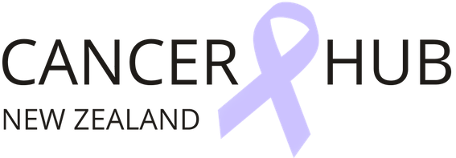

[CancerHub](https://cancerhub.net/) New Zealand promotes a network of cancer health professionals in New Zealand engaged in cancer research. The CancerHub web portal links cancer researchers together from around New Zealand, and provides powerful online resources for collaboration between researchers, and also with patients in the global effort against cancer.

CancerHub New Zealand is currently administered in the Eccles Lab research team at the Department of Pathology, Dunedin School of Medicine, University of Otago, Dunedin, NZ.

 

# Information on the NZM cell lines 

Over the last 20 years a unique series of cell lines (NZM cell lines) from metastatic melanomas (MMs) occurring in New Zealand patients has been developed (25). To date the NZM cell lines have been characterized for cell cycle time, drug sensitivity, and driver gene mutation status.

 
# Information on the RNAseq data

batches.

 
# Information on the RRBS data